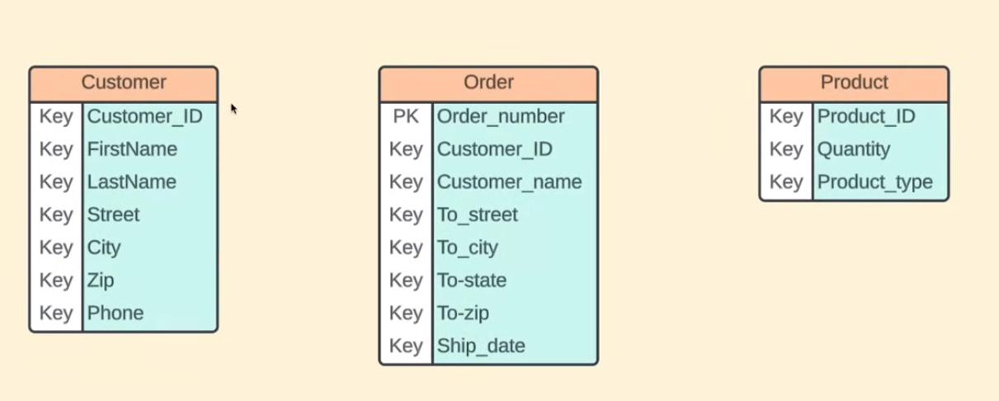
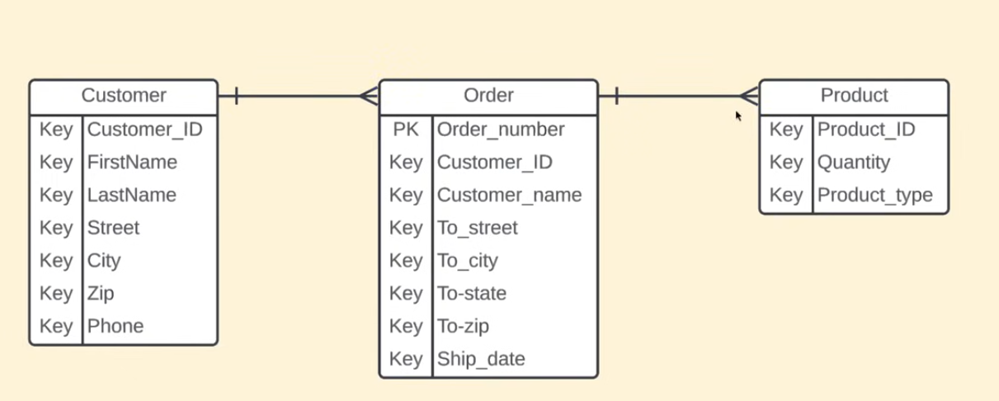
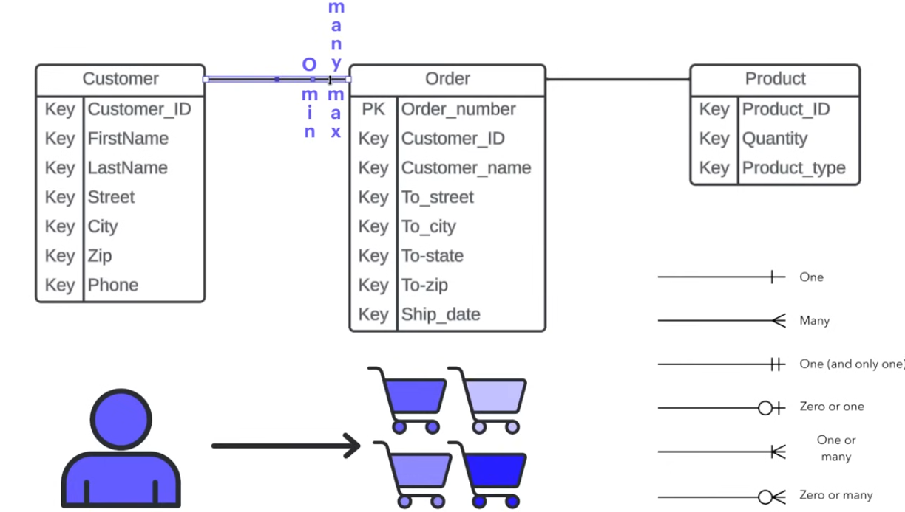

# Databáze Informace

## Entity Relationship Diagrams (zkratka: ERDs)

Databázový diagram obsahuje:  
**Entity, Atributy, Vztahy, Kardinality**

Kvůli tomu, že máme spoustu informací, které se pohybují v databázích, a porozumět každému elementu, jak interaguje s ostatními, může být složité…  
**ERD** poskytují inženýrovi vizuální způsob, jak pochopit, jak tyto informace mezi sebou fungují.

---

## Entity

- Objekt sledovaný v databázi.  
- Například: chceš si koupit crocsy na Amazonu — entitou může být **Zákazník**, **Objednávka**, **Produkt**.  
  Každá z těchto entit bude mít své **atributy**.

---

## Atributy

Pokud se podíváme na předchozí příklad, entita **Zákazník** má tyto atributy:  
`Customer_ID`, `FirstName`, `LastName`, `Street`, `City`, `Zip`, `Phone`

Entity v databázi budou vždy znázorněny jako **řádky** a jejich atributy budou vždy **sloupce**.

---

## Vztahy (Relationships)

Popisují, jak entity mezi sebou interagují.  
Když nakreslím čáru mezi určitými elementy, ukazuji tím, že mezi nimi existuje nějaký druh interakce nebo propojení.

---

## Kardinality (Cardinalities)

Kardinality pomáhají definovat vztahy v **číselném kontextu**, zejména z hlediska minim a maxim.  
Například tento seznam:  

zobrazuje různé typy kardinalit, které se mohou v **ERD** objevit.

---

Začněme tím, že se podíváme na **vztah a kardinalitu**, která existuje mezi **zákazníkem a objednávkou**.  
Nejlepší způsob, jak to pochopit, je přemýšlet logicky a položit si dvě otázky:  
1. Jaký je minimální počet objednávek, které může mít zákazník?  
2. Jaký je maximální počet objednávek, které může mít zákazník?

Zákazník může existovat, ale nemusí mít žádnou objednávku — proto použijeme **nulu (0)** jako minimum.  
Naopak zákazník může mít **nekonečný počet objednávek**, což ukazujeme příslušným symbolem.

---

Nyní si povězme o **minimálním a maximálním vztahu** mezi **objednávkami a zákazníky**.  
Použijeme stejnou logiku: jaký je minimální počet zákazníků, které může mít jedna objednávka?  
Konkrétní objednávka může mít **jednoho a pouze jednoho zákazníka**.
