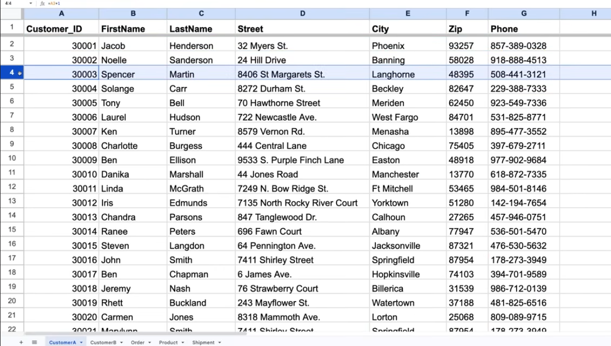
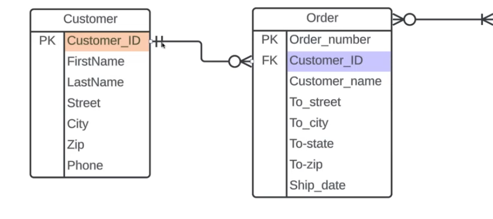
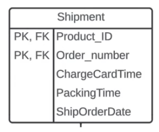

# Pokročilé ERDs

Budeme se zabývat: **Primary Keys**, **Foreign Keys**, **Bridge Tables**.

Na obrázku z minula můžeme vidět, že vedle každého atributu je napsáno „key“. Tento sloupec nám umožňuje rozlišit určité atributy jako buď **Primary Keys**, nebo **Foreign Keys**.

---

## Primary Keys

Začneme tím, že se naučíme, co jsou **Primary Keys**.  
Představme si entitu **Customer** jako tabulku s řádky a sloupci.

Představme si, že jsme Amazon a potřebujeme určit konkrétní objednávku nebo konkrétního zákazníka.  
**Primary key** je atribut nebo pole, které jednoznačně identifikuje každý záznam v určité tabulce.  
Protože jeden atribut může toto všechno splnit, dává smysl, že potřebujeme pouze **jeden Primary Key** na entitu.

---

### Pravidla pro Primary Key

1. **Primary Key** musí být jedinečný a identifikovat pouze jeden záznam v naší tabulce.  
2. Musí být **neměnný**.  
3. **Primary Key** nesmí být **NULL**.

Například když se podíváme do naší tabulky a vidíme **John Smith**, jaký údaj bychom mohli použít k jeho jednoznačné identifikaci?  
**ID!**

Pro **Primary Key** používáme zkratku **PK**.

---

## Foreign Key

Stejně jako **Primary Key**, jen se nachází v „cizím“ místě.  
Například: Možná máme **Primary Key** v jedné entitě, ale bylo by užitečné přenést tato data i do jiné.  
A právě tam vzniká **Foreign Key**.

Podívejme se, jak to funguje v našem diagramu.  
Už jsme si určili **customer_id** jako **Primary Key** pro entitu **Customer**, ale ten samý atribut se také nachází v entitě **Order**.  
Proč? Protože u každé objednávky chceme vědět, který zákazník ji vytvořil.  
Entita **Order** tedy pouze odkazuje na **customer_id** z entity **Customer**.  
To z ní dělá **Foreign Key** v entitě **Order**.

---

### Pravidla pro Foreign Key

1. Na rozdíl od **Primary Key** nemusí být **Foreign Key** jedinečný — může se v tabulce opakovat.  
2. Je možné mít více **Foreign Keys** v jedné entitě.

---

### Dva Foreign Keys v jedné entitě

---

## Composite Primary Key

Používají se tehdy, když je potřeba dvou nebo více atributů, aby bylo možné jednoznačně identifikovat každý záznam v tabulce.

Řekněme, že máme databázi zásilek a máme **Product_ID** a **Order_Number**.  
Samostatně se mohou tyto hodnoty opakovat, ale když je zkombinujeme dohromady, vytvoří **Primary Key**, který se neopakuje.

---

### Pravidla pro Composite Primary Key

- Používej co nejmenší počet atributů.  
- Nepoužívej atributy, které se mohou často měnit.

---

## Bridge Tables

Při vytváření **ERD** bychom se měli ptát, zda existuje něco dalšího, co by mělo být zaznamenáno v databázi.

Například: Někdy máme dvě entity, které jsou propojené, ale mezi nimi se odehrává víc, než je aktuálně vidět.  
V takovém případě použijeme **Bridge Table**.

Můžeme tedy použít tvar entity se třemi sloupci, kam přidáme i **data type**, což je obzvlášť užitečné při programování.

[DBTableDiagram](../../pictures/DBTableDiagram.png)
