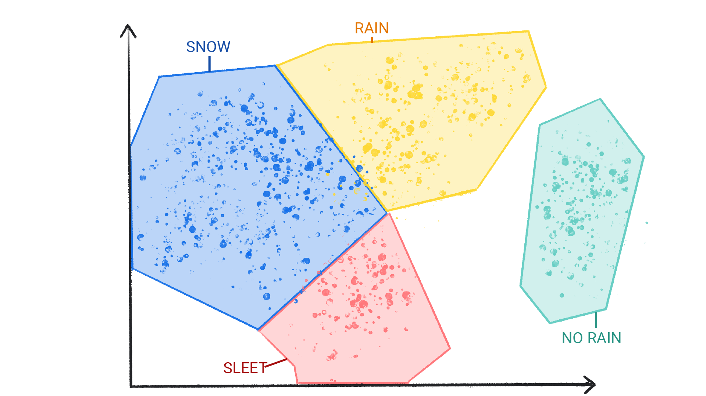

# Machine Learning

- je mnohem lepší, než klasický programování, neboť ML dokáže předpovídat, když má spousty dat.

- Řekněme, že máme weather app. Mohli bychom velmi složitě matematicky vypočítat, jaké bude počasí a nebo lépe a efektivněji dat spousty dat a udělat strojové učení.

- Machine learning je process trénování softwaru, zvaný model. Model je matematický vztah odvozený z dat, který systém ML používá k vytváření předpovědí.

- Typy ML (dělí se do jedné nebo více kategorií podle toho, jak se učí poředpovídat nebo generovat Obsah.)
    
    - Supervised Learning
    - Unsupervised Learning
    - Reinforcement Learning
    - Generative Ai
    
# Supervised Learning 

- mohou provádět předpovědí poté, co si prohlednou velké množství dat se *správnými* odpověďmi a poté objeví souvislosti mezi prvky v datech ,které vedou ke správným odpovědím.

- Je to podobné, jako když se student učí novou látku studiem starých zkoušek, které obsahují: jak otázky, tak odpovědi.

- Tyto systémy ML jsou ,,řízené" v tom smyslu, že člověk poskytuje systému ML data se známými správnými výsledky.

## Dva nejčastější případy použití Supervised Learning jsou *regression* a *classification*

### Regression 

Regresivní model předpovídá číselnou hodnotu. Například model počasí, který předpovídá množství srážek v palcích nebo milimetrech, je regresivní model. 

| Scénář            | Možné vstupní údaje                                                                                                                                  | Numerická předpověď                                       |
|:--------------------|:-----------------------------------------------------------------------------------------------------------------------------------------------------|:---------------------------------------------------------|
| Budoucí cena nemovitosti  | m2, PSČ, počet ložnic a koupelen... | Cena domu.                                   |
| Budoucí doba jízdyy    | historické dopravní podmínky.... atd | čas v minutách a sekundách. |

### Classification

**Classification model** předpovídá pravděpodobnost, že něco patří do určité kategorie.  

Na rozdíl od **regression modelu**, jehož výstupem je číslo, classification model vydává hodnotu, která udává, zda něco patří do určité kategorie.

---

#### 📌 Příklady použití
- Předpověď, zda e-mail je **spam** nebo **není spam**.
- Rozpoznání, zda fotografie obsahuje **kočku** nebo ne.

---

#### 📂 Typy klasifikace

##### 1. Binární klasifikace
- Výstupní třída obsahuje **pouze dvě hodnoty**.  
- Příklad: model, který predikuje buď:
  - **déšť**
  - **žádný déšť**

##### 2. Vícerozměrná klasifikace
- Výstupní třída obsahuje **více než dvě hodnoty**.  
- Příklad: model, který může predikovat:
  - **déšť**
  - **kroupy**
  - **sníh**
  - **déšť se sněhem**

# Unsupervised Learning

**Unsupervised learning modely** provádějí předpovědi na základě dat, která **neobsahují žádné správné odpovědi**.  
Cílem modelu je identifikovat smysluplné vzorce v datech.

Jinými slovy, model nemá žádné vodítko, jak jednotlivé údaje kategorizovat, ale musí odvodit **vlastní pravidla**.

---

## 📌 Clustering (shlukování)

Běžně používaný unsupervised learning model využívá techniku zvanou **clustering**.  
Model vyhledává datové body, které vytvářejí přirozené seskupení.

  
**Obrázek 1**. Model ML seskupující podobné datové body.

  
**Obrázek 2**. Skupiny clusterů s přirozenými hranicemi.

---

## 🔄 Rozdíl mezi Clustering a Classification
Clustering se liší od **classification** tím, že **kategorie nejsou předem definovány**.  

- U classification určíte kategorie vy (např. „spam / ne-spam“).  
- U clusteringu model sám najde skupiny podle podobnosti.

---

## 🌦 Příklad z praxe
Unsupervised model může seskupit dataset o **počasí** na základě teploty a odhalit segmentace, které odpovídají **ročním obdobím**.  
Poté můžete **pojmenovat clustery** na základě svého porozumění datům.

  
**Obrázek 3**. Model ML seskupující podobné meteorologické vzorce.

  
**Obrázek 4**. Clustery meteorologických jevů označené jako:  
- sníh  
- déšť se sněhem  
- déšť  
- bez deště

# Reinforcement Learning

**Reinforcement learning** modely provádějí předpovědi na základě **odměn nebo trestů** za akce provedené v daném prostředí.  

Reinforcement learning systém následně generuje pravidla, která definují **nejlepší strategii** pro získání co největšího počtu odměn.

---

## 📌 Příklady použití
- Výcvik **robotů** k provádění úkolů, například chůze po místnosti.  
- **Softwarové programy**, například **AlphaGo**, k hraní hry Go.
