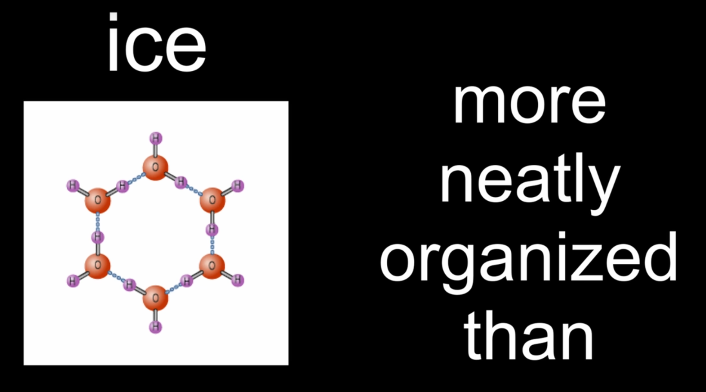
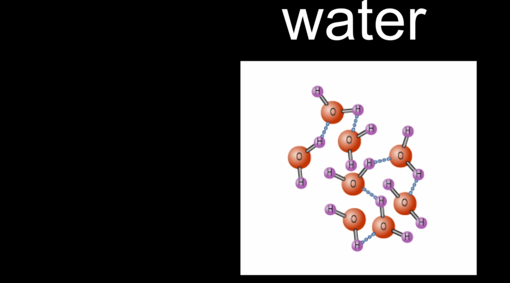

# Základy fyziky

- Nacházíte se na hornině (Zemi) plovoucí ve vesmíru, obklopené dalšími horninami, plynem a převážně prázdným prostorem.  
- Planety obíhají kolem hvězd díky **gravitaci**.

---

## Newton a gravitace

- **Isaac Newton** objevil, že:
  - Síla = hmotnost × akcelerace (F = m·a)
  - Síla je tlak (tlačit) nebo tah.
  - Hmotnost měří, kolik „hmoty“ je.
  - Akcelerace je rychlost změny rychlosti.
- Předpovídání pohybu: Pokud jsou známy všechny síly, je pohyb předvídatelný.
- **Zákon všeobecné gravitace**:
  - Dvě hmoty se navzájem přitahují.
  - Síla závisí na jejich hmotnosti a vzdálenosti.
  - Větší hmotnost = větší přitažlivá síla.
  - Větší vzdálenost = mnohem menší přitažlivá síla (Inverse-Square Zakon).

---

## Oběžné dráhy a pohyb

- Planety obíhají kolem Slunce díky gravitaci a své počáteční rychlosti.
- **Newtonův první zákon**: Tělesa v pohybu zůstávají v pohybu, pokud na ně nepůsobí externí síla.
- Oběžné dráhy jsou většinou eliptické, nikoli dokonale kruhové.
- Gravitace působí jako **středová síla**, která udržuje planety na oběžné dráze.

---

## Hmotnost vs. váha

- **Hmotnost**: Kolik hmoty máte.
- **Váha**: Gravitační síla působící na tuto hmotnost.
- Vaše hmotnost zůstává všude stejná, ale vaše váha se mění v závislosti na síle gravitace.
- Příklad: Na Měsíci vážíte méně.

---

## Energie a práce

- **Energie** (jednotka: joule) má dva hlavní typy:
  - **Kinetická energie**: energie pohybu.
  - **Potenciální energie**: uložená energie (např. předmět držený nad zemí).
- Když něco upustíte, potenciální energie → kinetická energie → teplo/zvuk při nárazu.
- **Práce** = síla × vzdálenost.
  - Zvednutí jablka o 1 m ≈ 1 joulu práce.
- Práce využívá energii, ale energie je schopnost vykonávat práci.
- **Žádný pohyb = žádná vykonaná práce**, bez ohledu na to, jak moc se snažíte.
- **Zachování energie**: Energie nemůže být vytvořena ani zničena, pouze přeměněna.

---

## Žár (heat) a teplota (temperature)

- Při brzdění automobilu se kinetická energie přemění na žár (heat) prostřednictvím tření.
- Žár zvyšuje pohyb molekul vzduchu.
- **Teplota** = průměrná kinetická energie atomů.
- Rychlejší pohyb atomů = vyšší teplota.

---

## Termodynamika a entropie

- **Entropie**: Míra neuspořádanosti nebo možných stavů v systému.  
- Entropie říká, že **některé formy energie jsou pro práci využitelnější než jiné**.  
- Led → Voda zvyšuje entropii (větší neuspořádanost).  
- Univerzum se vždy pohybuje směrem k vyšší entropii (větší neuspořádanosti).  
- Čas se zdá ubíhat vpřed kvůli rostoucí entropii.  
- Platí **zákon zachování energie**, ale ne všechna energie je stejně užitečná.  
- Lednice snižují lokální entropii (vzniká led), ale zvyšují celkovou entropii (uvolňují teplo).

---

## Elektřina a magnetismus

- Objekty mohou mít **kladný**, **záporný** nebo **neutrální** náboj.
- **Elektrony** mají záporný náboj; jejich pohyb je **elektrický proud**.
- Hlavní parametry:
  - **Proud (I)**: Tok náboje.
  - **Napětí (V)**: Rozdíl potenciálů, který tlačí náboje.
  - **Odpor (R)**: Odpor proti toku.
- **Coulombův zákon**: Náboje se přitahují/odpuzují jako hmotné částice v gravitaci.
  - Protiklady se přitahují, stejné se odpuzují.
- **Maxwellovy rovnice** vysvětlují elektromagnetismus:
  1. Elektrické náboje vytvářejí elektrická pole.
  2. Magnetické póly se vždy vyskytují v párech.
  3. Pohybující se magnety vytvářejí elektrická pole.
  4. Pohybující se náboje vytvářejí magnetická pole.
- **Indukce**: Pohybující se magnet v blízkosti vodiče indukuje proud (používá se při bezdrátovém nabíjení).
- **Elektromagnetické vlny** jsou interakce elektrických a magnetických polí – příkladem je světlo.

---

## Atomová struktura

- **Molekuly** → tvořené **atomy** → tvořené **protony**, **neutrony**, **elektrony**.
- **Protony/neutrony** → tvořené **kvarky**.
- **Standardní model** popisuje tyto základní částice.
- **Počet protonů** = druh prvku.
- **Počet neutronů** = druh izotopu.
- Nestabilní izotopy emitují radiaci a časem se rozpadají (**poločas rozpadu**).

---

## Světlo a relativita

- **Rychlost světla** = 299 792 458 m/s (nejrychlejší známá věc).
- Světlo se chová jako **vlna** (interference v double-slit experiment).
- **Einstein** ukázal, že světlo se chová také jako **částice (fotony)**.
- **Speciální relativita**:
  - Rychlost světla je konstantní.
  - Fyzikální zákony jsou stejné pro všechny pozorovatele.
  - Čas se pro pohybující se pozorovatele zpomaluje (časová dilatace).
  - Gravitace není síla, ale **zakřivení časoprostoru**.
- Masivní objekty zakřivují časoprostor; ostatní objekty následují zakřivené dráhy (orbity).
- **E = mc²**: Hmotnost a energie jsou ekvivalentní.
- **Štěpení**: Rozštěpení atomů za účelem uvolnění energie.
- **Fúze**: Spojení atomů za účelem uvolnění energie (hmotnostní defekt).

---

## Kvantová mechanika

- **Planck** zavedl pojem kvantované energie („kvanta“).
- **Elektrony** existují v **superpozici** – v několika stavech najednou, dokud nejsou změřeny.
- **Schrödingerova rovnice** předpovídá pravděpodobnost nalezení částic.
- **Heisenbergův princip neurčitosti**:
  - Nelze přesně znát polohu i rychlost.
- **Dualita vlna-částice**:
  - Světlo a částice se chovají jako vlny i jako částice.
- **Double-slit experiment** dokazuje, že částice interferují samy se sebou, pokud nejsou pozorovány.

---

## Shrnutí

- Fyzika spojuje vše: pohyb, gravitaci, energii, teplo, elektřinu, světlo a hmotu.
- Vesmír funguje na několika základních principech:
  - Zachování energie.
  - Zvýšení entropie.
  - Kvantová nejistota.
  - Relativita času a prostoru.

---