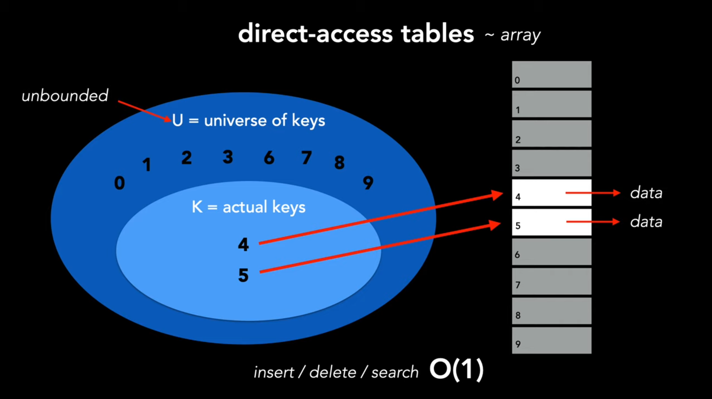
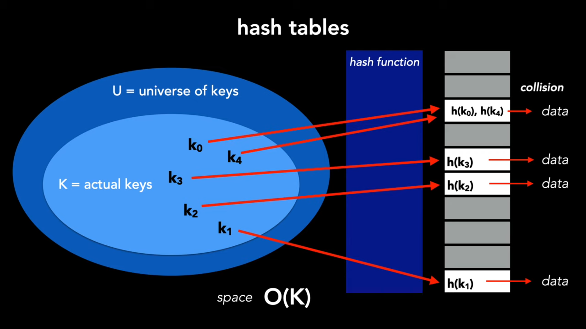

# LeetCode Patterns.

Tento soubor je „mapa“ základních technik pro LeetCode. Pojmy jako **array, subarray, substring, linked list, node, edge** nechávám v angličtině.

## Rychlý Checklist

1. **Jsou vstupy malé?** → zkus **Brute Force**.
2. **Mluví se o _substring_ nebo _subarray_?** → **Sliding Window**.
3. **Je to sorted? páry/dvojice/sum?** → **Two Pointers**.
4. **Potřebuješ frequency / O(1) lookup?** → **HashMap (dict)**.
5. **„next greater“, balanced parentheses, undo** → **Stack**.
6. **„K largest / K smallest“** → **Heap (priority queue)**.
7. **prefixy/slovník slov** → **Trie (prefix tree)**.
8. **„nodes/edges/graph/path/connected“** → **Graphs (DFS/BFS)**.

## 1) Sliding Window

### Co to je?

o sliding window uvažujeme jako o způsobu, jak efektivně zpracovat podmnožinu dat tím, že se v daném okamžiku zaměříme pouze na nejrelevantnější část.

### Typy Sliding Window

**Existují dva typy sliding window.**

- 1 Fixed sliding window 
    - fixed sliding window udržuje konstantní délku při posunu přes datovou strukturu
    - úloha zní: najít subarray nebo substring fixní délky (fixed lenght) 

- 2 Dynamic sliding window
    - Dynamic sliding window se na rozdíl od fixed window rozšiřuje a zmenšuje podle podmínek.
    - úloha vyžaduje, abychom našli nejdelší nebo nejkratší subarray/substring, který splňuje danou podmínku


### Kdy použít?

**1) Fixed-size Sliding Window (pevná délka K)**

**Kdy to použít**

Když zadání **výslovně** říká „přesně K“ prvků/znaků:

- „max sum subarray **of size K**“
- „průměr v okně o velikosti K“
- „počet 1’s v každém okně délky K“


### Jak to Vypadá na pozadí?

**1) Fixed-size (K je dané)**

Cíl: „max sum subarray of **size K**“.

**Array:** ```A = [2, 1, 3, 4, 2, 1]```, **K = 3**

Okna (vždy **3** prvky):

- krok 1: ```L=0, R=2``` → okno = ```[2, 1, 3]```
- krok 2: ```L=1, R=3``` → okno = ```[1, 3, 4]```
- krok 3: ```L=2, R=4``` → okno = ```[3, 4, 2]```
- krok 4: ```L=3, R=5``` → okno = ```[4, 2, 1]```

**Update v O(1)**: když posuneš okno, **přičteš** nový prvek na pravé straně a **odečteš** ten, co vypadl vlevo.

**Time**: O(n) (každý prvek přidáš jednou a odečteš jednou)

**2) Dynamic-size (délka se mění podle podmínky)**

**Cíl: „nejdelší subarray s sum ≤ S“.**

**Array**: ```A = [2, 1, 3, 1, 1, 1]```, **S = 5**

Postup (držím ```sum```):

- Start: ```L=0, R=0```, přidej ```2``` → ```sum=2``` (valid) → best=1
- ```R=1```, přidej ```1``` → ```sum=3``` (valid) → best=2
- ```R=2```, přidej ```3``` → ```sum=6``` (**>5**, nevalid) → posouvej **L**, dokud bude valid:
    - odeber ```A[L]=2``` → ```sum=4```, ```L=1``` (teď valid) → délka = ```R-L+1 = 2```
- ```R=3```, přidej ```1``` → ```sum=5``` (valid) → délka ```L=1..R=3``` je **3**, best=3
- ```R=4```, přidej ```1``` → ```sum=6``` (**>5**) → shrink:
    - odeber ```A[L]=1``` → ```sum=5```, ```L=2``` (valid) → délka ```2..4``` je 3 
- ```R=5```, přidej ```1``` → ```sum=6``` (**>5**) → shrink:
    - odeber ```A[L]=3``` → ```sum=3```, ```L=3``` (valid) → délka ```3..5``` je 3

**Všimni si: R vždy +1** (přidávám prvek).
Když poruším podmínku, **L posouvám klidně o 1, 2, 3…** zleva, **tak dlouho**, než je okno zase validní.

**Poznámka:** Okno neskáče „o 3“. Když K=3, okno pokrývá 3 prvky, ale ukazatele posouváš po 1.  

## 2) Two Pointers

### Co to je?

Nejprve si vysvětlíme, co je to pointer. Pointer je jednoduše proměnná, která představuje index nebo pozici v datové struktuře, jako je array nebo link-list. Pomocí pointerů na různých pozicích můžeme efektivně porovnávat prvky a činit rozhodnutí, aniž bychom se museli spoléhat na nested loops, které by vedly k time complexity $On^{2}$. 

### 3 nejčastější strategie.

**1) converging pointers**

V tomto přístupu pointery začínají na opačných koncích datové struktury a pohybují se směrem k sobě. Pointery upravují své pozice na základě porovnání, dokud není splněna určitá podmínka nebo se vzájemně neprotnou.

Tato strategie je ideální pro problémy, kde potřebujeme porovnat prvky z opačných konců arraye nebo stringu. 

**2) Parallel Pointers**

V tomto přístupu začínají oba pointery na stejném konci, obvykle na začátku, a pohybují se stejným směrem. Tyto pointery obecně plní dvě odlišné, ale vzájemně se doplňující role. Pravý pointer se používá k prozkoumávání nebo hledání nových informací a levý pointer se používá ke sledování pokroku nebo k udržování omezení.

**3) Trigger Based Pointers**

V tomto přístupu posouváme první pointer nezávisle, dokud nenajde prvek, který splňuje určitou podmínku. Poté začneme procházet druhým pointerem, abychom našli další informace související s tím, co našel pravý pointer. Tato technika je obzvláště užitečná, když potřebujeme zpracovat prvky v jednotlivých fázích. Dobrým příkladem tohoto přístupu je nalezení uzlu n (příklad linked-listu) z konce linked listu. Pohybujeme prvním pointerem a postupujeme vpřed, jakmile první pointer dosáhne uzlu n. Inicializujeme druhý pointer na začátku a pohybujeme oběma pointery po jednom kroku, dokud první pointer nedosáhne konce. V tomto bodě bude druhý pointer na uzlu n od konce. 

### Kdy použít?

Lineární datové struktury, jako jsou arraye, linked-listy, stringy. Silným náznakem toho, že problém lze vyřešit pomocí techniky Two Pointers, je, pokud vstupní data následují předvídatelný vzorec, jako je seřazený array nebo palindromický string.

Například v seřazeném arrayi posunutí pointeru doprava zajistí, že se vždy posunete k větší nebo stejné hodnotě, což usnadňuje porovnání hodnot u obou pointerů. 

Dalším silným indikátorem toho, že problém lze vyřešit pomocí dvou pointerů, je situace, kdy se výslovně požaduje dvojice hodnot, které splňují podmínku, nebo výsledek, který lze vygenerovat ze dvou hodnot.

## 3) HashMap (dict).

### Co to je?

Hash tables jsou datové struktury, které představují dynamický soubor dat. Hash tables podporují operace vkládání, mazání a vyhledávání. Hash tables vynikají zejména při vyhledávání, protože mají průměrnou dobu vyhledávání O(1), i když v nejhorším případě se tato doba zhoršuje na O(n). Termín hash table se někdy používá zaměnitelně s termínem dictionary. 

Dictionaries představují obecný způsob mapování klíčů.  

Implementace dictionary v podobě hash tabulky pomocí hash funkce. 

S tabulkami s přímým přístupem máme na levé straně zobrazený univerzum klíčů. Některé klíče jsou používány a odkazují na data. S tabulkami s přímým přístupem jsou operace vkládání, mazání a vyhledávání časově konstantní. Jinými slovy, tabulka s přímým přístupem je array a pokud potřebujete reprezentovat každý klíč v univerzu, říkáme, že U je neomezené a jeho uložení do paměti je nepraktické.



S hash tabulkami je prostorová náročnost je big o K = O(k). Kde K je počet klíčů. Abychom toho dosáhli, zavádíme hash funkci, která mapuje klíče na místo v tabulce, která obsahuje data. Protože náš vesmír klíčů již není neomezený. Je možné, že hashování dvou různých klíčů může vést ke stejné hodnotě, což se nazývá kolize. Jednou z metod, jak vyřešit kolize, je tzv. chaining.


