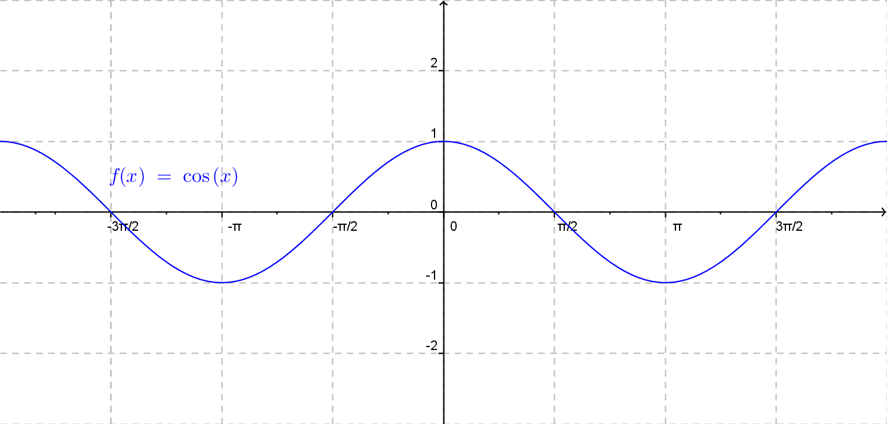

## 1. Základní perioda sinu

**Sinus** je funkce úhlu (v stupních nebo radiánech).

**Perioda** znamená úsek, po kterém se průběh funkce znovu opakuje.  
U funkce sinus je perioda:

$$ T = 360° \quad \text{nebo} \quad T = 2\pi \text{ rad} $$

Po uplynutí této periody se funkce zcela opakuje.

---

## 2. Graf sinusové funkce

  

Hodnoty funkce **sin(x)** se pohybují **mezi -1 a 1**.  
Tento rozsah odpovídá tzv. **jednotkové kružnici**.

Po **360°** (nebo $$\(2\pi\)$$ radiánech) se průběh funkce zcela opakuje.

---

## 3. Sudost a lichost funkcí

- **Sinus je funkce lichá.**
  - Lichost znamená **středovou souměrnost podle počátku souřadnic**.
  - Platí: $$ \sin(-x) = -\sin(x) $$

- **Kosinus je funkce sudá.**
  - Sudost znamená **souměrnost podle osy y**.
  - Platí: $$ \cos(-x) = \cos(x) $$

---

## 4. Vztah k osám souřadnic

| Funkce | Odpovídající osa | Význam |
|---------|------------------|---------|
| **cos(x)** | osa x (vodorovná) | určuje vodorovnou složku pohybu |
| **sin(x)** | osa y (svislá) | určuje svislou složku pohybu |

---

## 5. Tabulka základních hodnot

| Úhel (°) | Úhel (rad) | sin(x) | cos(x) |
|-----------|-------------|---------|---------|
| 0° | 0 | 0 | 1 |
| 30° | $$\frac{\pi}{6}$$ | 0.5 | 0.866 |
| 45° | $$\frac{\pi}{4}$$ | 0.707 | 0.707 |
| 60° | $$\frac{\pi}{3}$$ | 0.866 | 0.5 |
| 90° | $$\frac{\pi}{2}$$ | 1 | 0 |
| 120° | $$\frac{2\pi}{3}$$ | 0.866 | -0.5 |
| 150° | $$\frac{5\pi}{6}$$ | 0.5 | -0.866 |
| 180° | $$\pi$$ | 0 | -1 |
| 210° | $$\frac{7\pi}{6}$$ | -0.5 | -0.866 |
| 240° | $$\frac{4\pi}{3}$$ | -0.866 | -0.5 |
| 270° | $$\frac{3\pi}{2}$$ | -1 | 0 |
| 300° | $$\frac{5\pi}{3}$$ | -0.866 | 0.5 |
| 330° | $$\frac{11\pi}{6}$$ | -0.5 | 0.866 |
| 360° | $$2\pi$$ | 0 | 1 |

---

## 6. Shrnutí

- **Sinus** – lichá funkce, osa y, hodnoty od –1 do 1.  
- **Kosinus** – sudá funkce, osa x, hodnoty od –1 do 1.  
- **Perioda obou funkcí**: $$\(360°\)$$ nebo $$\(2\pi\)$$ rad.  
- Obě funkce se pravidelně opakují a jsou základem pro popis **periodických jevů** (např. vlnění, kruhový pohyb, střídavý proud).
