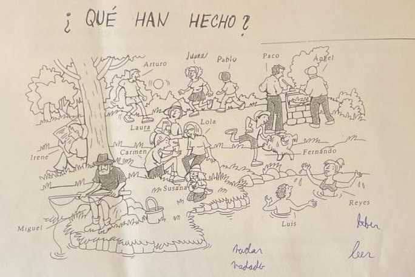

# Pretérito Perfecto Compuesto – Španělština

## 1. Vazba (Tvoření pravidelných tvarů)

| Infinitiv | Koncovka | Příčestí minulé |
|------------|-----------|----------------|
| -ar | → **-ado** | jugar → jugado |
| -er, -ir | → **-ido** | beber → bebido, ir → ido |

---

## 2. Kdy se používá *Pretérito Perfecto Compuesto*

Používá se tehdy, když má minulost **souvislost s přítomností** – tedy:

1. Děj se **stal nedávno**  
2. Děj **má dopad na přítomnost**  
3. Děj je součástí **časového úseku, který ještě neskončil**  
   (např. *dnes, tento týden, letos*)

---

## 3. Tvoření – Nepravidelné tvary

| Sloveso | Tvar |
|----------|------|
| decir | dicho |
| hacer | hecho |
| ver | visto |
| escribir | escrito |
| romper | roto |
| poner | puesto |
| cubrir | cubierto |
| abrir | abierto |
| morir | muerto |
| volver | vuelto |
| freír | freído / frito |

---

## 4. Použití – typické časové ukazatele

- hoy  
- esta noche, este verano, este mes...  
- ya  
- todavía no  
- alguna vez  
- hasta ahora  
- hace un rato / hace un momento / hace un minuto  

---

## 5. Ejemplos (Příklady)

- Arturo **ha jugado** al fútbol.  
- Irene **ha leído** un libro.  
- Luis y Reyes **han nadado**.  
- Carmen **ha bebido** una agua.  
  - *Beber → er → bebido*

---

## 6. Ejercicios

Doplň správný tvar slovesa v závorkách.  
Na konci každého cvičení je uveden klíč (správná odpověď).

---

### 1.
Esta mañana ... (ir, yo) al médico y después ... (comprar, yo) medicinas en la farmacia.  
**Klíč:** He ido, He comprado

---

### 2.
Este mes ... (haber) mucho turistas en Salamanca.  
**Klíč:** Ha habido

---

### 3.
Esta semana ... (leer, ella) dos libros de Agatha Christie.  
**Klíč:** Ha leído

---

### 4.
Este año ... (estar, nosotros) en Málaga y en Alicante.  
**Klíč:** Hemos estado

---

### 5.
Hoy ... (comer, nosotros) en el restaurante "Río Tormes".  
**Klíč:** Hemos comido

---

### 6.
Este mes ... (trabajar, tú) poco, pero ... (salir, tú) mucho por las noches.  
**Klíč:** Has trabajado, Has salido

---

### 7.
Hoy ... (levantarse, yo), ... (ducharse, yo) y después ... (ir, yo) a la Academia.  
**Klíč:** Me he levantado, Me he duchado, He ido

---

## 7. Utilizar el Pretérito Perfecto en las siguientes frases

1. Nosotros ... (reír) viendo la película de dibujos animados.  
**Klíč:** Hemos reído

2. ... (hacer, tú) los ejercicios? No, todavía no ... (hacer, yo) todos.  
**Klíč:** Has hecho, He hecho

3. ... (ir, tú) a la Academia esta mañana? No, ... (estar, yo) en mi casa enferma.  
**Klíč:** Has ido, He estado

4. ¿... (ir, vosotros) alguna vez a Japón? No, nunca ... (viajar, nosotros) allí.  
**Klíč:** Habéis ido, Hemos viajado

5. ... (pedir, yo) la cuenta al camarero y ... (pagar, yo).  
**Klíč:** He pedido, He pagado

---

## 8. Utilizar el Pretérito Perfecto

1. ¿... (ver, tú) la televisión este fin de semana? No, ... (hacer, yo) muchas cosas diferentes y muy interesantes.  
**Klíč:** Has visto, He hecho

2. ... (poner, yo) música, ... (escribir, yo) cartas a mi familia, ... (abrir, yo) la ventana de la cocina y ... (freír, yo) pescado para mis amigos.  
**Klíč:** He puesto, He escrito, He abierto, He freído
